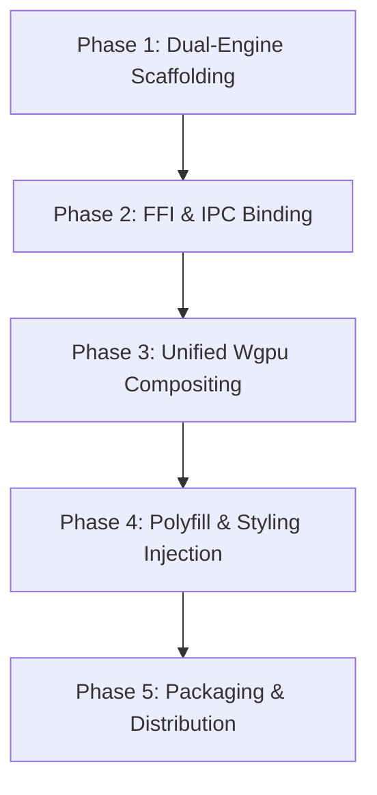

# Servo Engine Migration Plan
## Linux and Windows Native Shells

This document outlines the migration plan to transition Stremio Lightning's web-rendering engine from **WebKitGTK (Linux)** and **Microsoft WebView2 (Windows)** to the **Servo Web Engine**. 

Given Stremio Lightning’s architecture as a lightweight native wrapper around **Stremio Web** (`web.stremio.com`) with an external **Node.js streaming server sidecar** (`stremio-service`), this plan leverages Servo's ultra-low RAM footprint while actively resolving its layout, JS API, and media playback constraints.

---

## 1. Executive Summary & Goals

### The Problem
* **Linux (WebKitGTK):** The current WebKitGTK multi-process engine consumes **~965 MB RSS** for the web processes alone, pushing total application memory to **~1.42 GB RSS**.
* **Windows (WebView2):** Edge WebView2 spawns a coordinator, renderers, network managers, and GPU processes, taking **~150MB - 220MB** for a simple web interface.
* **Tails of Instability:** WebKitGTK suffers from packaging mismatches in standard Flatpak/GNOME sandboxes, and WebView2 relies on OS updates that can break custom FFI IPC bindings.

### The Target
* **RAM Capping:** Reduce total application memory (including Rust core and Node.js server) to **< 350 MB RSS** (with Servo's renderer consuming **~50MB - 100MB**).
* **Single-Process Execution:** Run web layout, JS execution, and native windowing on a unified, lightweight Rust thread loop.
* **Graphic Pipeline Consolidation:** Share a unified Vulkan/DirectX context via `wgpu` and WebRender, allowing smooth alpha-blended transparent UI overlays on top of the native `libmpv` video plane.

---

## 2. Platform Comparison: Legacy vs. Servo Target

| Dimension | Linux (Legacy WebKitGTK) | Linux (Target Servo) | Windows (Legacy WebView2) | Windows (Target Servo) |
| :--- | :--- | :--- | :--- | :--- |
| **GUI Framework** | GTK4 + `WebKitWebView` | Winit + Wgpu + WebRender | Win32 + `webview2-com` | Winit + Wgpu + WebRender |
| **Process Model** | Multi-Process (Sandbox) | Single-Process (Threaded) | Multi-Process (Edge swarm) | Single-Process (Threaded) |
| **Compositing** | GTK Overlay (`GLArea` + Overlay) | Unified GPU Texture Blend | HWND Child window overlay | Unified GPU Texture Blend |
| **Video Deck** | Native `libmpv` | Native `libmpv` | Native `libmpv` | Native `libmpv` |
| **Distribution** | Flatpak / Host WebKit | Embedded Static Binary | System WebView2 Runtime | Bundled Servo DLLs (~60MB) |

---

## 3. Stremio Web Compatibility Audit & Mitigation

Because Stremio Lightning wraps **Stremio Web** and offloads heavy database/caching workloads, migrating to Servo is highly viable if we address the specific web-compatibility gaps detailed below:

### 3.1. Local Storage and Session Persistence
* **Status:** **FULLY COMPATIBLE.**
* **Mechanism:** Unlike standalone desktop clients that use SQLite or large local databases, Stremio Web saves session tokens (`auth.key` inside `"profile"`) and UI preferences strictly in browser **`localStorage`**. Large media buffers and torrent caches are entirely handled by the Node.js streaming server sidecar (`stremio-service`) writing directly to host paths (`~/.config/stremio-server`).
* **Mitigation:** No actions required. Servo has robust, native `localStorage` persistence that matches browser standards.

### 3.2. CSS Grid Poster Layouts
* **Status:** **PARTIAL COMPATIBILITY BLOCKER.**
* **Mechanism:** Stremio Web uses CSS Grid to format catalogs of movie posters and search results. In Servo, CSS Grid (powered by `Taffy`) is disabled by default and suffers from overlap/clipping bugs.
* **Mitigations:**
  1. **Engine Preferences:** Force-enable layout support on startup by passing `--pref layout.grid.enabled=true` into the Servo initialization parameters.
  2. **Compat Stylesheet Injection:** Inject a custom CSS bridge file (`web/bridge/servo-compat.css`) at document start. This script overrides CSS Grid with robust Flexbox and `flex-wrap` fallback rules specifically when the user-agent is identified as Servo:
     ```css
     /* Fallback override for poster catalogs */
     .catalog-grid-class-selector {
       display: flex !important;
       flex-wrap: wrap !important;
       gap: 16px !important;
     }
     ```

### 3.3. Modern DOM APIs (Svelte/React Integration)
* **Status:** **COMPATIBILITY BLOCKER.**
* **Mechanism:** Stremio Web's Svelte components use modern browser APIs like `IntersectionObserver` to trigger lazy-loading of poster thumbnail images during scrolling. Gaps in Servo's JS API coverage will throw exceptions and halt Svelte script execution.
* **Mitigation:**
  * **Polyfill Injection:** Inject standard, lightweight W3C polyfills (`web/bridge/polyfills.js`) on `document_start` before Stremio Web executes:
    ```javascript
    // Simple IntersectionObserver Polyfill Stub if not present
    if (!('IntersectionObserver' in window)) {
      window.IntersectionObserver = class IntersectionObserver {
        constructor(callback) { this.callback = callback; }
        observe(element) { 
          // Immediately trigger load callback to bypass lazy-loading blocks
          this.callback([{ isIntersecting: true, target: element }]);
        }
        unobserve() {}
        disconnect() {}
      };
    }
    ```

### 3.4. YouTube Embeds (Movie Trailers)
* **Status:** **BLOCKER.**
* **Mechanism:** Clicking "Trailer" in Stremio Web launches a YouTube player iframe. Servo's JS engine cannot run the complex, heavy scripts required by the modern YouTube Player framework, resulting in silent crashes or blank frames.
* **Mitigation:**
  * **Native Redirection Bridge:** Modify `web/bridge/shell-transport.js` to intercept iframe creations or click events targeting `youtube.com/embed/`. Convert these requests into a native command sent back to the Rust wrapper:
    ```javascript
    // Intercept trailer launches
    window.addEventListener('click', (e) => {
      const link = e.target.closest('a[href*="youtube.com"]');
      if (link) {
        e.preventDefault();
        // Route directly to native MPV player or default system web browser
        window.__STREMIO_LIGHTNING_IPC__("invoke", { 
          command: "play_external_trailer", 
          url: link.href 
        });
      }
    }, true);
    ```

---

## 4. Phased Implementation Plan



### Phase 1: Dual-Engine Scaffolding (Coexistence)
* **Objective:** Introduce Servo support without breaking existing WebKitGTK and WebView2 systems.
* **Tasks:**
  * Introduce a `--engine` CLI parameter (`--engine=webkit` [default] and `--engine=servo`).
  * Add the `servo` Rust crate as an optional dependency behind a `servo-engine` cargo feature flag:
    ```toml
    [dependencies]
    servo = { git = "https://github.com/servo/servo", optional = true }
    ```
  * Scaffolding modular window traits `WebviewShell` implemented by both `LinuxWebviewRuntime` and the new `ServoWebviewRuntime`.

### Phase 2: FFI and IPC Bindings
* **Objective:** Bridge the Servo thread with the shared Rust core IPC dispatcher.
* **Tasks:**
  * Initialize the Servo instance inside a dedicated Rust background thread.
  * Wire Servo's Script Message interface to receive calls from Stremio's JS layer.
  * Map Servo FFI callbacks into `stremio-lightning-core`’s IPC router (`dispatch_ipc`), executing window actions (minimize, toggle maximize, window drag) and routing playback requests directly to the MPV manager thread.

### Phase 3: Unified Wgpu Compositing (The Core Rendering Path)
* **Objective:** Draw transparent web UI elements directly on top of the native MPV video rendering plane.
* **Tasks:**
  * Implement a single `winit` window loop on Linux and Windows.
  * Initialize a unified `wgpu` graphic device context.
  * Run the `libmpv` rendering context inside an OpenGL/Vulkan texture layer.
  * Instruct Servo's `WebRender` instance to render the Stremio Web UI with a transparent background.
  * Composite the layers in a single pass: **[Background Clear] -> [MPV Video Texture] -> [Servo Web UI Overlay]**.

### Phase 4: Polyfill & Styling Injection
* **Objective:** Ensure Stremio Web renders flawlessly and doesn't stall on loading spinners.
* **Tasks:**
  * Package the `servo-compat.css` overrides and `polyfills.js` stubs inside `stremio-lightning-core`'s standard `InjectionBundle`.
  * Inject these assets at the absolute start (`document_start`) of any page loading lifecycle.
  * Force the User-Agent header to append `Servo/StremioLightning` to enable tailored server-side optimizations.

### Phase 5: GStreamer Windows Packaging & Binary Optimization
* **Objective:** Guarantee clean installations without system-wide dependency issues.
* **Tasks:**
  * **Linux:** Leverage Flatpak sandbox extensions to compile/bundle the Servo runtime library, avoiding host-level GLIBC conflicts.
  * **Windows:** Package the required GStreamer runtime DLLs (~50MB stripped) alongside the Servo engine library inside the MSI/Nullsoft installer.
  * Optimize compilation flags specifically for SpiderMonkey to trim binary overhead.

---

## 5. Verification Plan

### Automated Pipeline Verification
* **CI Build Gates:** Add a runner checking compilation with the feature enabled:
  ```bash
  cargo check --features "servo-engine" -p stremio-lightning-linux
  cargo check --features "servo-engine" -p stremio-lightning-windows
  ```
* **IPC Integration Verification:** Run IPC command-routing tests against a headless Servo mock instance to verify response/request parsing without spawning a GUI window.

### Manual Smoke-Testing Matrix
Before merging Servo to the main release branch, perform the following validation steps:
1. **Startup Performance:** Assert the window renders in `< 2.5 seconds` and memory consumption remains below `350MB RSS`.
2. **Library Sync:** Authenticate with a Stremio account, verify `localStorage` preserves the login session, and library data fetches successfully.
3. **Layout Inspection:** Verify movie grids display correct aspect ratios and flow correctly across responsive resizes without card overlapping.
4. **Trailer Redirection:** Assert that clicking "Watch Trailer" triggers the native MPV engine or default system web browser, avoiding in-engine YouTube script errors.
5. **Compositing Integrity:** Validate there are no flashing frames, screen tearing, or black frames when switching to fullscreen video playback.
